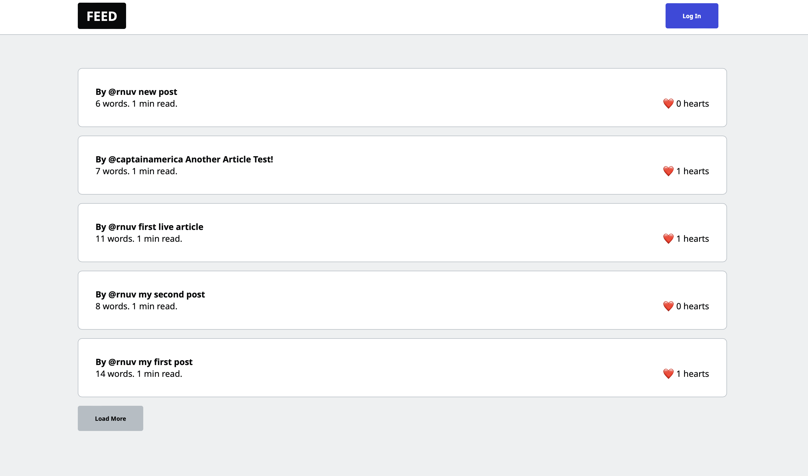
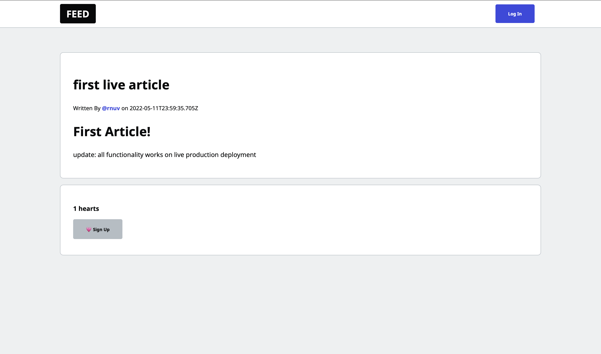

# NextFire Blog

## Description
Link: [nextfire-blog-app.vercel.app](nextfire-blog-app.vercel.app)

A Medium like social blogging platform that allows authors to post realtime content that is search engine optimized and bot-friendly. The full stack web application features server side rendering standards like SSR and ISR through Next.js, Firestore data modeling, user authentication, custom usernames, hearts and image file uploads. Deployment is done using Vercel and fully protected with security rules specified in Firebase.

## Pictures

  

  

  Home page and Example Article page.

## Technologies
- 
- 
- 
- 
- 
- OAuth 2.0

---
*Made with <3 by Arnav, circa 2022*
